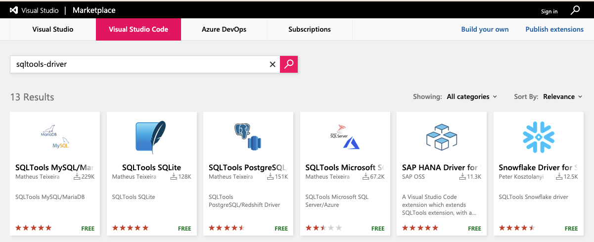

# Quick setup to help those learning MySQL and PostgreSQL.

This is a simple Docker Compose setup using [Docker](https://www.docker.com), and [MySQL](https://www.mysql.com/) and [PostgreSQL](https://www.postgresql.org/) databases.
Quick way to deploy both databases for learning MySQL and PostgreSQL.
This is used in the demonstration of development of both MySQL and PostgreSQL on [Docker Desktop](https://www.docker.com/products/docker-desktop/alternatives).

Below are the steps required to get this working on a base linux system.

- Clone mysql-postgres repo
- Install SQLTools drivers: MySQL/MariaDB and PostreSQL (Optional)
- Install Docker Desktop
- Verify Docker setup
- Start and deploy containers using docker-compose.yml
- MySQL Docker container
- PostgreSQL Docker container
- Stop MySQL and PostgreSQL database containers

## 1. Clone mysql-postgres repo

```
git clone https://github.com/fusion52/mysql-postgres.git
```

By default, your directory will be **mysql-postgres**. Allow this default. The docker container names will begin with this name. For example: **mysql-postgres_mysql-db_1**

```
cd mysql-postgres
```

```
tree .
```

    .
    ├── LICENSE
    ├── README.md
    ├── docker-compose.yml
    ├── mysql
    │   ├── README.md
    │   ├── setup.sql
    │   └── test.sql
    ├── postgres
    │   ├── README.md
    │   ├── setup.sql
    │   └── test.sql
    └── vscode-extensions.png

    2 directories, 10 files

## 2. Install SQLTools drivers: MySQL/MariaDB and PostreSQL (Optional)

Optional for those using [Visual Studio Code](https://code.visualstudio.com/) IDE.
Install [Visual Studio Code](https://marketplace.visualstudio.com/vscode) extensions.

- SQLTools MySQL/MariaDB Driver
- SQLTools PostgreSQL/Redshift Driver

Search for: **sqltools-driver**



## 3. Install Docker Desktop

Download [Docker Desktop](https://www.docker.com/products/docker-desktop/alternatives) for your operating system.

Install Docker Desktop on your development server. Docker Compose will be included in the installation.

## 4. Verify Docker setup

Check docker version

```
docker --version

Docker version 20.10.8, build 3967b7d
```

Check docker compose version

```
docker-compose --version

docker-compose version 1.29.2, build 5becea4c
```

## 5. Start and deploy containers using docker-compose.yml

Start and deploy MySQL and PostgreSQL database containers.

```
docker-compose up -d
```

Check container logs. View output from containers.

```
docker-compose logs
```

```
Attaching to mysql-postgres_postgres-db_1, mysql-postgres_mysql-db_1
mysql-db_1     | 2021-12-09 03:43:28+00:00 [Note] [Entrypoint]: Entrypoint script for MySQL Server 8.0.27-1debian10 started.
mysql-db_1     | 2021-12-09 03:43:28+00:00 [Note] [Entrypoint]: Switching to dedicated user 'mysql'
mysql-db_1     | 2021-12-09 03:43:28+00:00 [Note] [Entrypoint]: Entrypoint script for MySQL Server 8.0.27-1debian10 started.
...
postgres-db_1  |
postgres-db_1  | PostgreSQL Database directory appears to contain a database; Skipping initialization
postgres-db_1  |
postgres-db_1  | 2021-12-09 03:43:28.946 UTC [1] LOG:  starting PostgreSQL 14.1 (Debian 14.1-1.pgdg110+1) on x86_64-pc-linux-gnu, compiled by gcc (Debian 10.2.1-6) 10.2.1 20210110, 64-bit
postgres-db_1  | 2021-12-09 03:43:28.947 UTC [1] LOG:  listening on IPv4 address "0.0.0.0", port 5432
postgres-db_1  | 2021-12-09 03:43:28.947 UTC [1] LOG:  listening on IPv6 address "::", port 5432
```

List containers.

```
docker-compose ps
```

```
            Name                          Command               State                          Ports
---------------------------------------------------------------------------------------------------------------------------
mysql-postgres_mysql-db_1      docker-entrypoint.sh --def ...   Up      0.0.0.0:3306->3306/tcp,:::3306->3306/tcp, 33060/tcp
mysql-postgres_postgres-db_1   docker-entrypoint.sh postgres    Up      0.0.0.0:5432->5432/tcp,:::5432->5432/tcp
```

## 6. MySQL Docker container

### Test connection and Setup (default password is 'password')

For development only. Passing password in the command. **_mysql -u root -password_**

```
docker exec -it mysql-postgres_mysql-db_1 /bin/bash -c "mysql -u root -ppassword < /tmp/test.sql"
docker exec -it mysql-postgres_mysql-db_1 /bin/bash -c "mysql -u root -ppassword < /tmp/setup.sql"
```

```
docker exec -it mysql-postgres_mysql-db_1 /bin/bash -c "mysql -u root -ppassword -e 'SELECT version()'"
docker exec -it mysql-postgres_mysql-db_1 /bin/bash -c "mysql -u root -ppassword -e 'SELECT * FROM mysql.user'"
```

### Login Database

```
docker exec -it mysql-postgres_mysql-db_1 /bin/bash -c "mysql -u root -ppassword"
```

## 7. PostgreSQL Docker container

### Test connection and Setup (default password is 'password')

For development only. Add PGPASSWORD environment variable.

```
export PGPASSWORD='password';
```

```
docker exec -it mysql-postgres_postgres-db_1 /bin/bash -c "psql -U postgres postgres -a -f /tmp/test.sql"
docker exec -it mysql-postgres_postgres-db_1 /bin/bash -c "psql -U postgres postgres -a -f /tmp/setup.sql"
```

```
docker exec -it mysql-postgres_postgres-db_1 psql -U postgres postgres -c  "SELECT version()"
docker exec -it mysql-postgres_postgres-db_1 psql -U postgres postgres -c "\l+"
```

### Login Database

```
docker exec -it mysql-postgres_postgres-db_1 /bin/bash -c "psql -U postgres postgres"
```

## 8. Stop MySQL and PostgreSQL database containers

Stop MySQL and PostgreSQL database containers.
Stop and remove resources.

```
docker-compose down
```
